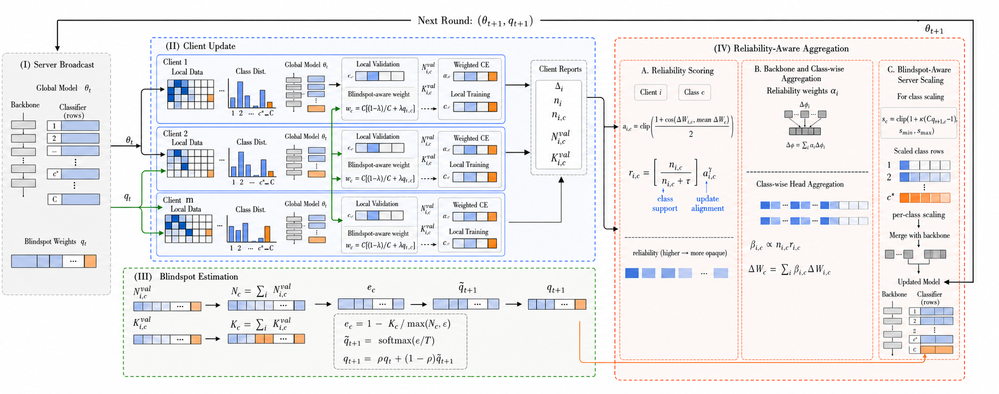

# FedRBA: Reliability- and Blindspot-Aware Federated Learning

This repository contains the implementation and reproducibility artifacts for
FedRBA, a federated-learning method designed to mitigate minority-class
prediction collapse under class imbalance and heterogeneous client data.

The implementation covers one multi-class image benchmark and two real-world
credit-risk datasets:

- Fashion-MNIST
- Default of Credit Card Clients (UCI dataset 350)
- Give Me Some Credit (Kaggle)

The central empirical claim is deliberately narrow: FedRBA improves
minority-class recall and reduces collapse relative to general-purpose
federated baselines while retaining comparable performance at
validation-matched operating points. It is not uniformly best on ROC-AUC,
PR-AUC, or every fixed operating point.

> **Review status:** keep this repository private during double-blind review.
> Dataset files, Kaggle credentials, model checkpoints, and cluster logs are
> intentionally excluded.

## FedRBA Framework

The overall workflow of the proposed FedRBA framework is illustrated below.

<p align="center">
  
</p>

<p align="center">
  <em>Overall workflow of the proposed FedRBA framework.</em>
</p>

## Method

FedRBA combines three mechanisms:

1. **Dynamic class blindspot estimation.** Selected clients evaluate the
   broadcast model on local validation data and report per-class aggregate
   counts, loss sums, and correct counts. The server updates a smoothed
   class-blindspot distribution.
2. **Blindspot-aware local learning and server scaling.** Underperforming
   classes receive stronger local loss weights and, optionally, stronger
   classifier-row updates.
3. **Reliability-aware aggregation.** Backbone updates are weighted by sample
   count and update alignment; classifier rows are aggregated separately using
   class sample sufficiency and class-specific update alignment.

See [docs/METHOD.md](docs/METHOD.md) for equations, baselines, and ablations.

## Repository layout

```text
.
|-- artifacts/                 # Audited aggregate tables, figures, and workbook
|-- configs/                   # Dataset and experiment configuration
|-- docs/                      # Method, HPC, results, and reproducibility notes
|-- scripts/                   # Matrix builders, Slurm launchers, and analyses
|-- src/                       # Data, models, federated training, and metrics
|-- tests/                     # Offline unit and two-round smoke tests
|-- train.py                   # Training entry point
|-- evaluate.py                # Checkpoint and multi-run evaluation
`-- requirements.txt
```

## Installation

Python 3.10 or 3.11 is recommended.

```bash
python -m venv .venv
source .venv/bin/activate
python -m pip install --upgrade pip
python -m pip install -r requirements.txt
```

On a CUDA cluster, install the PyTorch build recommended for the cluster before
installing the remaining requirements. The archived experiments used Python
3.10 and PyTorch 2.6.0+cu124.

Verify the environment:

```bash
python -c "import torch; print(torch.__version__, torch.cuda.is_available())"
python -m pytest tests -q
```

## Data

Data files are not redistributed.

### Fashion-MNIST

`torchvision` downloads the dataset on first use into `data/FashionMNIST`.

### Default of Credit Card Clients

The loader fetches UCI dataset 350 through `ucimlrepo` and caches it under
`data/default_credit`. A local CSV/XLS/XLSX path can instead be supplied with:

```bash
python train.py --config configs/default_credit.yaml --algorithm fedrba \
  --override dataset.path=/path/to/default_credit_file.xls
```

### Give Me Some Credit

Accept the Kaggle competition rules, download `cs-training.csv`, and place it at:

```text
data/give_me_some_credit/cs-training.csv
```

If the Kaggle CLI is authenticated, `bash scripts/prepare_data.sh` performs the
download. The unlabeled competition test file is never used as the paper test
set.

## Quick smoke run

```bash
python train.py \
  --config configs/fashion_mnist.yaml \
  --algorithm fedrba \
  --device cpu \
  --override federated.rounds=2
```

The runner refuses to overwrite an existing run directory unless
`--overwrite` is explicitly supplied.

## Reproduce the experiment matrices

### Main 90-run matrix

```bash
python scripts/build_experiment_matrix.py \
  --profile full \
  --seeds 1 2 3 \
  --output scripts/experiments_main.txt
wc -l scripts/experiments_main.txt
```

Expected: 90 commands.

- Fashion-MNIST: 5 methods x 3 Dirichlet alphas x 3 seeds = 45
- Default Credit: 5 methods x 2 alphas x 3 seeds = 30
- Give Me Some Credit: 5 methods x 1 alpha x 3 seeds = 15

### Credit ablations

```bash
python scripts/build_credit_ablation_matrix.py \
  --alphas 0.1 0.3 \
  --seeds 1 2 3 \
  --output scripts/experiments_ablations.txt
```

Expected: 18 commands for three component-removal variants. FedAvg and full
FedRBA are reused from the main matrix.

### Explicit quantity skew

```bash
python scripts/audit_quantity_skew_partitions.py \
  --config configs/default_credit.yaml \
  --alpha 0.3 \
  --sigma 1.5 \
  --seeds 1 2 3

python scripts/build_quantity_skew_matrix.py \
  --profile full \
  --alpha 0.3 \
  --sigma 1.5 \
  --seeds 1 2 3 \
  --output scripts/experiments_quantity_skew.txt
```

Expected: 15 commands. The audit must pass before launching the full matrix.

### Validation-matched operating points

```bash
python scripts/build_operating_point_matrix.py --help
python scripts/aggregate_operating_points.py --help
```

Thresholds and checkpoints are selected from validation data only. Test data is
used once for reporting fixed-FPR recall and fixed-recall precision.

See [docs/HPC.md](docs/HPC.md) for the Slurm workflow and
[docs/REPRODUCIBILITY.md](docs/REPRODUCIBILITY.md) for the complete protocol.

## Verified artifacts

The `artifacts/` directory contains:

- aggregate main, operating-point, ablation, and quantity-skew tables;
- four paper figures in PNG and PDF;
- the final results workbook;
- source and curve audit metadata.

The archived audit covers 90/90 main runs, 18/18 credit-ablation runs, 15/15
quantity-skew runs, and 45 validation-matched operating-point evaluations.
All paper summaries use the mean of the last 20 communication rounds per run,
then report mean and standard deviation across three seeds.

See [docs/RESULTS.md](docs/RESULTS.md) for the supported claims and limitations.

## Important scope limitations

- The repository implements a centralized simulation of federated learning. It
  does not include a distributed deployment protocol.
- Per-class client validation aggregates are shared with the server. Secure
  aggregation, differential privacy, and formal privacy guarantees are out of
  scope.
- Tabular preprocessing is fitted on the central training split before client
  partitioning. This experimental assumption is disclosed and should not be
  confused with fully decentralized preprocessing.
- Give Me Some Credit exhibits substantial round-to-round minority-metric
  volatility, so conclusions are based on multi-seed trailing-window summaries,
  collapse rate, and operating-point analysis rather than the final round alone.

## License and citation

No open-source license is attached while the repository remains a private
double-blind submission artifact. Add the final author list, citation record,
and chosen license only after the review policy permits deanonymization.

